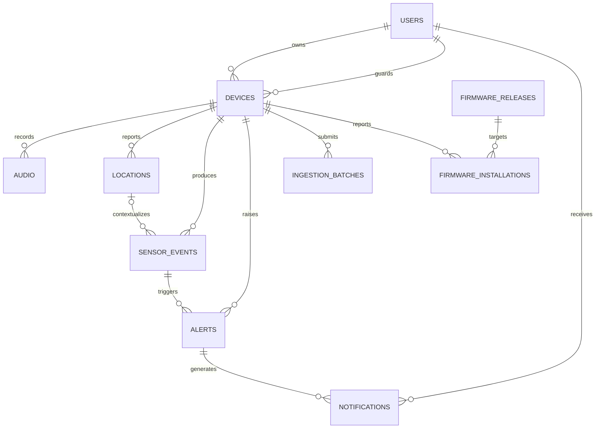

# Database Schema

This document describes the database schema represented by the GORM models in
[`models/`](../models/). Table and column names follow GORM's default naming
conventions unless a `column` tag explicitly overrides the name.

## Entity relationship diagram

Most declared foreign keys use `ON UPDATE CASCADE` and `ON DELETE CASCADE`.
Consequently, deleting a device also deletes its ingestion batches and other
device-owned records. The optional sensor-event location relationship instead
uses `ON DELETE SET NULL`. Firmware installations are deleted with their
device, while referenced firmware releases use `ON DELETE RESTRICT`.

## Tables

### `users`

Application users. A user can own devices, guard devices, and receive
notifications.

| Column | Database type | Null | Key / index | Default | Description |
| --- | --- | --- | --- | --- | --- |
| `id` | `uuid` | No | Primary key | — | User identifier. |
| `username` | `varchar(100)` | No | — | — | Display or login name. |
| `email` | `varchar(255)` | No | Unique index | — | Unique email address. |
| `password_hash` | `text` | No | — | — | Password hash; excluded from JSON responses. |
| `role` | `varchar(20)` | No | — | `VIEWER` | Authorization role. See [Enum values](#enum-values). |
| `created_at` | timestamp | No¹ | — | Auto-created | Creation time managed by GORM. |
| `updated_at` | timestamp | No¹ | — | Auto-updated | Last update time managed by GORM. |

### `devices`

Physical cane devices. Each device has one owner and one guardian.

| Column | Database type | Null | Key / index | Default | Description |
| --- | --- | --- | --- | --- | --- |
| `id` | `uuid` | No | Primary key | — | Device identifier. |
| `owner_user_id` | `uuid` | No | Index, FK → `users.id` | — | Device owner's user ID. |
| `guardian_user_id` | `uuid` | No | Index, FK → `users.id` | — | Guardian's user ID. |
| `name` | `varchar(100)` | No | — | — | Human-readable device name. |
| `status` | `varchar(25)` | No | — | `ONLINE` | Current device state. |
| `battery_level` | `integer` | No¹ | — | Go zero value | Battery level reported by the device. |
| `hardware_version` | `varchar(50)` | Yes | Index | `NULL` | Hardware revision used to select compatible firmware releases. |
| `firmware_version` | `varchar(25)` | Yes | — | `NULL` | Installed firmware version. |
| `credential_hash` | `text` | Yes | &mdash; | `NULL` | Bcrypt hash of the long-lived device credential; excluded from JSON responses. |
| `last_seen_at` | timestamp | No¹ | — | Go zero value | Most recent device contact time. |
| `created_at` | timestamp | No¹ | — | Auto-created | Creation time managed by GORM. |

### `audio`

Audio exchanged between a device user and the assistant.

| Column | Database type | Null | Key / index | Default | Description |
| --- | --- | --- | --- | --- | --- |
| `id` | `uuid` | No | Primary key | — | Audio record identifier. |
| `device_id` | `uuid` | No | Index, FK → `devices.id` | — | Source or destination device. |
| `direction` | `varchar(30)` | No | — | — | Direction of the audio exchange. |
| `storage_key` | `text` | No | — | — | Object-storage key for the audio file. |
| `transcript` | `text` | Yes | — | `NULL` | Speech-to-text transcript. |
| `response_text` | `text` | Yes | — | `NULL` | Assistant response text. |
| `status` | `varchar(20)` | No | — | `UPLOADED` | Audio processing state. |
| `created_at` | timestamp | No¹ | — | Auto-created | Creation time managed by GORM. |

### `locations`

Location samples reported by a device.

| Column | Database type | Null | Key / index | Default | Description |
| --- | --- | --- | --- | --- | --- |
| `id` | `uuid` | No | Primary key | — | Location sample identifier. |
| `device_id` | `uuid` | No | Index, FK → `devices.id` | — | Reporting device. |
| `external_location_id` | `varchar(100)` | Yes | Composite unique index with `device_id` | `NULL` | Firmware-provided retry/idempotency identifier. |
| `latitude` | `double precision` | No | — | — | Latitude in decimal degrees. |
| `longitude` | `double precision` | No | — | — | Longitude in decimal degrees. |
| `accuracy_meters` | `double precision` | No | — | — | Estimated positional accuracy in metres. |
| `recorded_at` | timestamp | No | Index | — | Time at which the location was recorded. |

### `sensor_events`

Structured events emitted by a device.

| Column | Database type | Null | Key / index | Default | Description |
| --- | --- | --- | --- | --- | --- |
| `id` | `uuid` | No | Primary key | — | Sensor event identifier. |
| `device_id` | `uuid` | No | Index, FK → `devices.id` | — | Device that emitted the event. |
| `external_event_id` | `varchar(100)` | Yes | Composite unique index with `device_id` | `NULL` | Firmware-provided retry/idempotency identifier. |
| `location_id` | `uuid` | Yes | Index, FK to `locations.id` | `NULL` | Optional location associated with the event; set to `NULL` if that location is deleted. |
| `event_type` | `varchar(30)` | No | — | — | Event category. |
| `severity` | `varchar(20)` | No | — | — | Event severity. |
| `event_data` | `jsonb` | No | — | — | Event-specific structured payload. |
| `recorded_at` | timestamp | No | Index | — | Time at which the event was recorded. |

### `ingestion_batches`

Stored telemetry-batch responses used to make firmware retries idempotent. A
device can submit many batches, but each `message_id` is unique per device.

| Column | Database type | Null | Key / index | Default | Description |
| --- | --- | --- | --- | --- | --- |
| `id` | `uuid` | No | Primary key | &mdash; | Ingestion batch identifier. |
| `device_id` | `uuid` | No | Index, composite unique index, FK to `devices.id` | &mdash; | Device that submitted the batch. |
| `message_id` | `varchar(100)` | No | Composite unique index with `device_id` | &mdash; | Firmware-provided batch idempotency identifier. |
| `response` | `jsonb` | No | &mdash; | &mdash; | Original API response returned again for retries. |
| `created_at` | timestamp | No1 | &mdash; | Auto-created | Creation time managed by GORM. |

### `alerts`

Alerts created from sensor events for a device.

| Column | Database type | Null | Key / index | Default | Description |
| --- | --- | --- | --- | --- | --- |
| `id` | `uuid` | No | Primary key | — | Alert identifier. |
| `device_id` | `uuid` | No | Index, FK → `devices.id` | — | Device associated with the alert. |
| `sensor_event_id` | `uuid` | No | Index, FK → `sensor_events.id` | — | Sensor event that triggered the alert. |
| `alert_type` | `varchar(25)` | No | — | — | Alert category. |
| `message` | `text` | No | — | — | Human-readable alert message. |
| `status` | `varchar(20)` | No | — | `ACTIVE` | Alert lifecycle state. |
| `created_at` | timestamp | No¹ | — | Auto-created | Creation time managed by GORM. |
| `resolved_at` | timestamp | Yes | — | `NULL` | Time at which the alert was resolved. |

### `notifications`

Notifications sent to users for alerts.

| Column | Database type | Null | Key / index | Default | Description |
| --- | --- | --- | --- | --- | --- |
| `id` | `uuid` | No | Primary key | — | Notification identifier. |
| `user_id` | `uuid` | No | Index, FK → `users.id` | — | Notification recipient. |
| `alert_id` | `uuid` | No | Index, FK → `alerts.id` | — | Related alert. |
| `message` | `text` | No | — | — | Notification body. |
| `is_read` | `boolean` | No | — | `false` | Whether the recipient has read the notification. |
| `sent_at` | timestamp | No | Index | — | Time at which the notification was sent. |

¹ The Go field is a non-pointer value. The model does not include an explicit
`not null` GORM tag for this column; final database nullability can therefore
depend on the generated migration and database dialect.

### `firmware_releases`

Signed firmware artifacts published for a specific hardware revision. A
`hardware_version` and `version` pair identifies one release.

| Column | Database type | Null | Key / index | Default | Description |
| --- | --- | --- | --- | --- | --- |
| `id` | `uuid` | No | Primary key | &mdash; | Firmware release identifier. |
| `version` | `varchar(25)` | No | Composite unique index with `hardware_version` | &mdash; | Firmware software version. |
| `hardware_version` | `varchar(50)` | No | Index, composite unique index with `version` | &mdash; | Exact supported device hardware revision. |
| `download_url` | `text` | No | &mdash; | &mdash; | Firmware artifact download location. |
| `file_size_bytes` | `bigint` | No | &mdash; | &mdash; | Artifact size in bytes. |
| `sha256` | `char(64)` | No | &mdash; | &mdash; | Hexadecimal SHA-256 digest. |
| `signature` | `text` | No | &mdash; | &mdash; | Cryptographic signature checked by firmware. |
| `mandatory` | `boolean` | No | &mdash; | `false` | Whether the update must be installed. |
| `published_at` | timestamp | No | Index | &mdash; | Publication time; future releases are excluded from lookup. |
| `created_at` | timestamp | No1 | &mdash; | Auto-created | Creation time managed by GORM. |
| `updated_at` | timestamp | No1 | &mdash; | Auto-updated | Last update time managed by GORM. |

### `firmware_installations`

Immutable firmware lifecycle reports submitted by devices. The pair
`(device_id, message_id)` makes firmware retries idempotent.

| Column | Database type | Null | Key / index | Default | Description |
| --- | --- | --- | --- | --- | --- |
| `id` | `uuid` | No | Primary key | &mdash; | Installation report identifier. |
| `device_id` | `uuid` | No | FK to `devices.id`, composite unique and timeline indexes | &mdash; | Reporting device. |
| `release_id` | `uuid` | No | Index, FK to `firmware_releases.id` | &mdash; | Target firmware release. |
| `message_id` | `varchar(100)` | No | Composite unique index with `device_id` | &mdash; | Firmware-provided idempotency identifier. |
| `status` | `varchar(25)` | No | Timeline index | &mdash; | Installation lifecycle status. |
| `error_code` | `varchar(50)` | Yes | &mdash; | `NULL` | Machine-readable failure code for `FAILED`. |
| `error_message` | `varchar(500)` | Yes | &mdash; | `NULL` | Failure detail for `FAILED`. |
| `reported_at` | timestamp | No | Timeline index | &mdash; | Device timestamp for the event. |
| `created_at` | timestamp | No1 | &mdash; | Auto-created | Server persistence time managed by GORM. |

## Enum values

The enums are stored as strings. The application defines the following allowed
values, although the model tags do not create database-level `CHECK`
constraints.

| Enum | Used by | Values |
| --- | --- | --- |
| `Role` | `users.role` | `ADMIN`, `CANE_USER`, `GUARDIAN` |
| `DeviceStatus` | `devices.status` | `ONLINE`, `OFFLINE`, `INACTIVE` |
| `AudioDirection` | `audio.direction` | `USER_TO_ASSISTANT`, `ASSISTANT_TO_USER` |
| `FirmwareInstallationStatus` | `firmware_installations.status` | `DOWNLOADING`, `DOWNLOADED`, `VERIFYING`, `VERIFIED`, `INSTALLING`, `INSTALLED`, `ROLLED_BACK`, `FAILED` |
| `AudioStatus` | `audio.status` | `UPLOADED`, `PROCESSING`, `COMPLETED`, `FAILED` |
| `SensorEventType` | `sensor_events.event_type` | `FALL_DETECTED`, `OBSTACLE_DETECTED`, `SOS_TRIGGERED`, `LOW_BATTERY`, `DEVICE_STARTED`, `DEVICE_ERROR` |
| `EventSeverity` | `sensor_events.severity` | `INFO`, `WARNING`, `CRITICAL` |
| `AlertType` | `alerts.alert_type` | `FALL`, `SOS`, `LOW_BATTERY`, `DEVICE_OFFLINE` |
| `AlertStatus` | `alerts.status` | `ACTIVE`, `ACKNOWLEDGED`, `RESOLVED` |

## Schema notes

- The `users.role` default is `VIEWER`, but `VIEWER` is not defined in the
  `Role` enum. Inserts that rely on this default can therefore create a value
  the application does not recognize.
- UUID primary keys do not declare a database default or a GORM create hook.
  The application must assign each UUID before insertion unless migrations add
  a database-side default.
- Relationships are declared through GORM associations. The actual database
  constraints depend on the migration configuration being allowed to create
  foreign keys.
- `sensor_events.event_data` has no fixed JSON schema; its shape depends on the
  corresponding `event_type`.
- `(ingestion_batches.device_id, ingestion_batches.message_id)` is unique, so
  retrying a telemetry batch returns its stored original response.
- `(firmware_releases.hardware_version, firmware_releases.version)` is unique;
  compatibility is an exact match against `devices.hardware_version`.
- `(firmware_installations.device_id, firmware_installations.message_id)` is
  unique, so a retry returns the originally stored event.
- A new `INSTALLED` report updates `devices.firmware_version` in the same
  transaction that stores the report.
